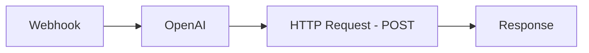
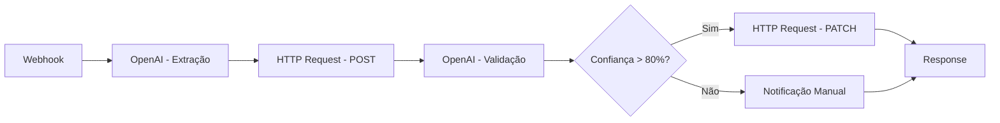
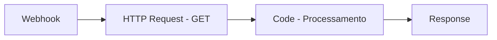
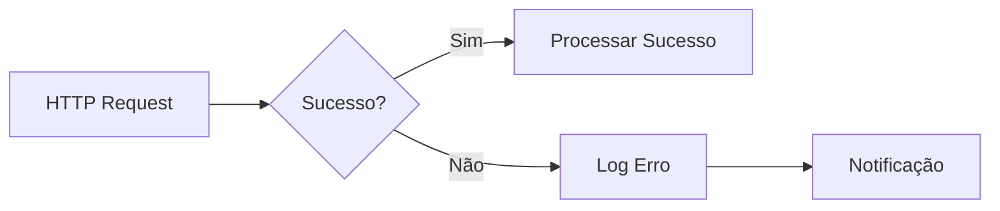

# 🔗 Integração n8n + PostgREST

Este documento mostra como configurar o n8n para usar o PostgREST ao invés do nó PostgreSQL direto, permitindo maior flexibilidade e melhor performance.

## 🎯 Vantagens do PostgREST

- **Flexibilidade**: HTTP requests permitem mais controle sobre as operações
- **Performance**: Menos overhead de conexão direta com banco
- **Escalabilidade**: API REST pode ser balanceada e cacheada
- **Debugging**: Logs HTTP são mais fáceis de debugar
- **Segurança**: Controle granular de permissões via API

## 🔧 Configuração dos Nós n8n

### 1. Nó HTTP Request - Inserir Dados

**Configuração:**
```json
{
  "method": "POST",
  "url": "http://localhost:3000/interactions",
  "headers": {
    "Content-Type": "application/json"
  },
  "body": {
    "text_input": "{{ $json.text_input }}",
    "processed_data": "{{ $json.processed_data }}",
    "status": "{{ $json.status }}",
    "confidence_score": "{{ $json.confidence_score }}"
  }
}
```

**Exemplo de dados de entrada:**
```json
{
  "text_input": "João Silva, 30 anos, desenvolvedor",
  "processed_data": "{\"nome\": \"João Silva\", \"idade\": 30, \"profissao\": \"desenvolvedor\"}",
  "status": "processed",
  "confidence_score": 0.85
}
```

### 2. Nó HTTP Request - Buscar Dados

**Configuração:**
```json
{
  "method": "GET",
  "url": "http://localhost:3000/interactions?status=eq.processed&order=created_at.desc&limit=10"
}
```

**Exemplos de filtros:**
- `status=eq.processed` - Status igual a "processed"
- `confidence_score=gte.0.8` - Confiança maior ou igual a 0.8
- `text_input=like.*João*` - Texto contém "João"
- `created_at=gte.2024-01-01` - Criado após 01/01/2024

### 3. Nó HTTP Request - Atualizar Dados

**Configuração:**
```json
{
  "method": "PATCH",
  "url": "http://localhost:3000/interactions?id=eq.{{ $json.id }}",
  "headers": {
    "Content-Type": "application/json"
  },
  "body": {
    "status": "completed",
    "confidence_score": 0.95
  }
}
```

### 4. Nó HTTP Request - Deletar Dados

**Configuração:**
```json
{
  "method": "DELETE",
  "url": "http://localhost:3000/interactions?id=eq.{{ $json.id }}"
}
```

## 🔄 Exemplos de Workflows

### Workflow 1: Processamento Básico



**Configuração do nó OpenAI:**
```json
{
  "model": "gpt-3.5-turbo",
  "messages": [
    {
      "role": "system",
      "content": "Extraia nome, idade e profissão do texto fornecido. Retorne em formato JSON."
    },
    {
      "role": "user",
      "content": "{{ $json.text_input }}"
    }
  ]
}
```

**Configuração do nó HTTP Request:**
```json
{
  "method": "POST",
  "url": "http://localhost:3000/interactions",
  "headers": {
    "Content-Type": "application/json"
  },
  "body": {
    "text_input": "{{ $json.text_input }}",
    "processed_data": "{{ $json.choices[0].message.content }}",
    "status": "processed",
    "confidence_score": 0.9
  }
}
```

### Workflow 2: Validação com Reasoning Loop



**Configuração do nó de validação:**
```json
{
  "model": "gpt-3.5-turbo",
  "messages": [
    {
      "role": "system",
      "content": "Avalie a qualidade da extração. Retorne apenas um número entre 0 e 1 representando a confiança."
    },
    {
      "role": "user",
      "content": "Texto original: {{ $json.text_input }}\nExtração: {{ $json.processed_data }}"
    }
  ]
}
```

**Configuração do nó IF:**
```json
{
  "conditions": {
    "number": [
      {
        "value1": "{{ $json.choices[0].message.content }}",
        "operation": "gt",
        "value2": 0.8
      }
    ]
  }
}
```

### Workflow 3: Consulta com Filtros Avançados



**Configuração do nó HTTP Request:**
```json
{
  "method": "GET",
  "url": "http://localhost:3000/interactions?select=id,text_input,status,confidence_score&status=in.(processed,completed)&confidence_score=gte.0.7&order=created_at.desc&limit=20"
}
```

**Configuração do nó Code:**
```javascript
// Processar dados retornados
const interactions = $input.all();

// Agrupar por status
const grouped = interactions.reduce((acc, item) => {
  const status = item.json.status;
  if (!acc[status]) acc[status] = [];
  acc[status].push(item.json);
  return acc;
}, {});

// Calcular estatísticas
const stats = {
  total: interactions.length,
  byStatus: Object.keys(grouped).map(status => ({
    status,
    count: grouped[status].length,
    avgConfidence: grouped[status].reduce((sum, item) => sum + item.confidence_score, 0) / grouped[status].length
  })),
  avgConfidence: interactions.reduce((sum, item) => sum + item.json.confidence_score, 0) / interactions.length
};

return [{ json: stats }];
```

## 🛠️ Tratamento de Erros

### Configuração de Retry

**No nó HTTP Request:**
```json
{
  "retry": {
    "enabled": true,
    "maxTries": 3,
    "waitBetweenTries": 1000
  }
}
```

### Tratamento de Erro com IF



**Configuração do nó IF para erro:**
```json
{
  "conditions": {
    "number": [
      {
        "value1": "{{ $json.statusCode }}",
        "operation": "gte",
        "value2": 400
      }
    ]
  }
}
```

## 📊 Monitoramento e Logs

### Logs de Requisições

Configure o nó HTTP Request para log detalhado:
```json
{
  "options": {
    "logResponse": true,
    "logRequest": true
  }
}
```

### Métricas de Performance

Use o nó Code para calcular métricas:
```javascript
const startTime = Date.now();

// ... requisição HTTP ...

const endTime = Date.now();
const duration = endTime - startTime;

// Log da performance
console.log(`Requisição PostgREST: ${duration}ms`);

return $input.all();
```

## 🔐 Autenticação (Opcional)

### JWT Token

Se configurar autenticação JWT no PostgREST:

```json
{
  "method": "POST",
  "url": "http://localhost:3000/interactions",
  "headers": {
    "Content-Type": "application/json",
    "Authorization": "Bearer {{ $env.POSTGREST_JWT_TOKEN }}"
  },
  "body": {
    "text_input": "{{ $json.text_input }}",
    "processed_data": "{{ $json.processed_data }}",
    "status": "processed",
    "confidence_score": 0.85
  }
}
```

## 🚀 Migração do PostgreSQL Direto

### Antes (PostgreSQL Direto)
```json
{
  "operation": "insert",
  "table": "interactions",
  "columns": {
    "text_input": "{{ $json.text_input }}",
    "processed_data": "{{ $json.processed_data }}",
    "status": "{{ $json.status }}",
    "confidence_score": "{{ $json.confidence_score }}"
  }
}
```

### Depois (PostgREST)
```json
{
  "method": "POST",
  "url": "http://localhost:3000/interactions",
  "headers": {
    "Content-Type": "application/json"
  },
  "body": {
    "text_input": "{{ $json.text_input }}",
    "processed_data": "{{ $json.processed_data }}",
    "status": "{{ $json.status }}",
    "confidence_score": "{{ $json.confidence_score }}"
  }
}
```

## 📚 Recursos Adicionais

- [Documentação PostgREST](https://postgrest.org/en/stable/)
- [Filtros e Consultas](https://postgrest.org/en/stable/api.html#filters)
- [Exemplos de Workflows n8n](https://docs.n8n.io/workflows/)
- [HTTP Request Node](https://docs.n8n.io/integrations/builtin/cluster-nodes/sub-nodes/n8n-nodes-base.httpRequest/) 